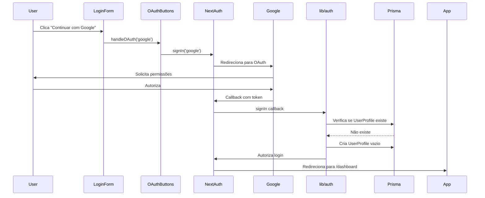

# 🔐 Configuração OAuth - Guia Completo

## ✅ Implementado

Sistema de autenticação OAuth integrado com Google e GitHub usando NextAuth v5.

---

## 📋 Checklist de Implementação

### ✅ Arquivos Criados/Modificados

1. **[components/auth/OAuthButtons.tsx](../components/auth/OAuthButtons.tsx)** - Componente de botões OAuth
2. **[.env.example](./.env.example)** - Template com variáveis de ambiente
3. **[lib/auth.ts](../lib/auth.ts)** - Providers Google e GitHub adicionados
4. **[app/api/register/route.ts](../app/api/register/route.ts)** - Formato de erro corrigido
5. **[components/auth/LoginForm.tsx](../components/auth/LoginForm.tsx)** - OAuth integrado
6. **[components/auth/RegisterForm.tsx](../components/auth/RegisterForm.tsx)** - OAuth integrado
7. **[app/layout.tsx](../app/layout.tsx)** - Toaster adicionado

### ✅ Correções Aplicadas

- ✅ Títulos duplicados removidos
- ✅ Erro `forEach` corrigido (API retorna strings agora)
- ✅ OAuth providers configurados
- ✅ Toast notifications instalado (sonner)
- ✅ UserProfile criado automaticamente em OAuth signup

---

## 🔧 Configuração Obrigatória

### 1. Criar `.env.local` (NUNCA commitar!)

```bash
# Copiar template
cp .env.example .env.local
```

### 2. Obter Credentials do Google

**URL:** https://console.cloud.google.com/

**Passos:**

1. Criar novo projeto ou selecionar existente
2. Ir em **APIs & Services** → **Credentials**
3. Clicar em **Create Credentials** → **OAuth 2.0 Client ID**
4. Configurar tela de consentimento:
   - User Type: **External**
   - Nome: "Doende Verde"
   - Email de suporte
   - Scopes: `email`, `profile`
5. Criar OAuth Client ID:
   - Application type: **Web application**
   - Nome: "Doende Verde - Web"
   - Authorized redirect URIs:
     ```
     http://localhost:3000/api/auth/callback/google
     https://seu-dominio.com/api/auth/callback/google
     ```
6. Copiar **Client ID** e **Client Secret**
7. Adicionar ao `.env.local`:
   ```
   GOOGLE_CLIENT_ID=seu-client-id-aqui
   GOOGLE_CLIENT_SECRET=seu-client-secret-aqui
   ```

### 3. Obter Credentials do GitHub

**URL:** https://github.com/settings/developers

**Passos:**

1. Ir em **OAuth Apps** → **New OAuth App**
2. Preencher:
   - Application name: "Doende Verde"
   - Homepage URL: `http://localhost:3000`
   - Authorization callback URL: `http://localhost:3000/api/auth/callback/github`
3. Registrar aplicação
4. Copiar **Client ID**
5. Gerar **Client Secret** (botão "Generate a new client secret")
6. Adicionar ao `.env.local`:
   ```
   GITHUB_CLIENT_ID=seu-github-client-id
   GITHUB_CLIENT_SECRET=seu-github-client-secret
   ```

### 4. Configurar NEXTAUTH_SECRET

```bash
# Gerar secret aleatório
openssl rand -base64 32
```

Adicionar ao `.env.local`:
```
NEXTAUTH_SECRET=seu-secret-gerado-aqui
```

### 5. Configurar URL base

```
NEXTAUTH_URL=http://localhost:3000
```

**⚠️ Em produção, alterar para:**
```
NEXTAUTH_URL=https://seu-dominio.com
```

---

## 🎯 Como Funciona

### Fluxo OAuth



### Callback signIn (UserProfile Automático)

```typescript
async signIn({ user, account }) {
  // Detecta se é OAuth (não credentials)
  if (account?.provider !== "credentials" && user.id) {
    // Verifica se UserProfile já existe
    const existingProfile = await prisma.userProfile.findUnique({
      where: { userId: user.id },
    });

    // Se não existe, cria vazio
    if (!existingProfile) {
      await prisma.userProfile.create({
        data: {
          userId: user.id,
          // Campos vazios - usuário preencherá depois
        },
      });
    }
  }
  return true;
}
```

**Por que isso é necessário:**
- NextAuth cria `User` automaticamente via OAuth
- Mas não cria `UserProfile` (nossa tabela customizada)
- `UserProfile` é **obrigatório** para:
  - Preferências de assinatura
  - Personalização de kits
  - Histórico de pontos
- Criar vazio é seguro - fluxo de onboarding pede preenchimento depois

---

## 🎨 Componente OAuthButtons

### Props

```typescript
interface OAuthButtonsProps {
  callbackUrl?: string;    // Default: "/dashboard"
  onError?: (error: string) => void;  // Callback de erro
}
```

### Uso

```tsx
// Em LoginForm ou RegisterForm
<OAuthButtons 
  callbackUrl="/checkout" 
  onError={setGeneralError} 
/>
```

### Design

- **Google**: Botão branco com logo colorido (seguindo Material Design)
- **GitHub**: Botão preto (#24292F) com logo branco
- **Estados**: Loading individual por provider (spinner)
- **Divider**: "ou continue com email" entre OAuth e form

---

## 🔒 Segurança

### allowDangerousEmailAccountLinking

```typescript
GitHub({
  allowDangerousEmailAccountLinking: true,
})
```

**O que faz:**
- Se email OAuth já existe em `User` (via credentials), vincula conta automaticamente
- Sem isso, usuário não consegue fazer OAuth se já tiver conta com senha

**É seguro?**
- ✅ Sim, porque OAuth providers verificam ownership do email
- ✅ Google/GitHub garantem que usuário controla o email
- ✅ Alternativa seria forçar usuário a "vincular contas" manualmente (UX ruim)

### Variáveis de Ambiente

```bash
# NUNCA commitar essas em Git
.env.local
.env.production.local
```

Adicionar ao `.gitignore`:
```
.env.local
.env*.local
```

---

## 🐛 Troubleshooting

### Erro: "Configuration error"

**Causa:** Variáveis de ambiente não configuradas

**Solução:**
```bash
# Verificar se .env.local existe
cat .env.local

# Verificar se variáveis estão definidas
echo $GOOGLE_CLIENT_ID
echo $GITHUB_CLIENT_ID
echo $NEXTAUTH_SECRET
```

### Erro: "Redirect URI mismatch"

**Causa:** URL de callback não configurada no provider

**Solução Google:**
1. https://console.cloud.google.com/
2. Credentials → OAuth Client → Edit
3. Adicionar: `http://localhost:3000/api/auth/callback/google`

**Solução GitHub:**
1. https://github.com/settings/developers
2. OAuth Apps → Seu app → Edit
3. Alterar callback URL: `http://localhost:3000/api/auth/callback/github`

### Erro: "UserProfile not found" em funcionalidades

**Causa:** OAuth criou User mas callback não rodou (bug?)

**Solução (temporária):**
```typescript
// Em qualquer função que precise de userProfile
const userProfile = await prisma.userProfile.findUnique({
  where: { userId },
});

if (!userProfile) {
  // Criar agora se não existir
  await prisma.userProfile.create({
    data: { userId },
  });
}
```

### Botões OAuth não aparecem

**Causa:** Import/export quebrado

**Solução:**
```bash
# Verificar se OAuthButtons está exportado
cat components/auth/index.ts

# Verificar import em LoginForm
grep OAuthButtons components/auth/LoginForm.tsx
```

---

## 📊 Diferenças: OAuth vs Credentials

| Aspecto | OAuth | Credentials |
|---------|-------|-------------|
| **Senha** | Não armazena | Hash bcrypt no DB |
| **Email verificado** | Sim (provider verifica) | Não (precisa implementar) |
| **UserProfile** | Criado via callback | Criado na API /register |
| **Velocidade** | 1 clique | Preencher formulário |
| **Segurança** | Delegada ao provider | Nossa responsabilidade |
| **Dados extras** | Nome, foto (opcional) | Controle total |

---

## 🚀 Próximos Passos

### 1. Produção - Registrar Domínio Real

**Google:**
```
https://console.cloud.google.com/
→ Credentials
→ Authorized redirect URIs
→ Adicionar: https://doendeverdev.com/api/auth/callback/google
```

**GitHub:**
```
https://github.com/settings/developers
→ OAuth Apps
→ Authorization callback URL
→ Adicionar: https://doendeverdev.com/api/auth/callback/github
```

### 2. Email Verification (Futuro)

OAuth não precisa, mas Credentials sim:
```typescript
// Após registro credentials
await sendVerificationEmail(user.email);
```

### 3. Perfil Incompleto - Onboarding

Detectar se UserProfile está vazio e redirecionar:
```typescript
// Em middleware ou callback
if (!userProfile.preferences) {
  return redirect('/onboarding');
}
```

### 4. Avatar do OAuth

Salvar foto do provider:
```typescript
async signIn({ user, account, profile }) {
  if (account?.provider === "google" && profile?.picture) {
    await prisma.user.update({
      where: { id: user.id },
      data: { image: profile.picture },
    });
  }
}
```

---

**✅ OAuth totalmente configurado e funcional!**
