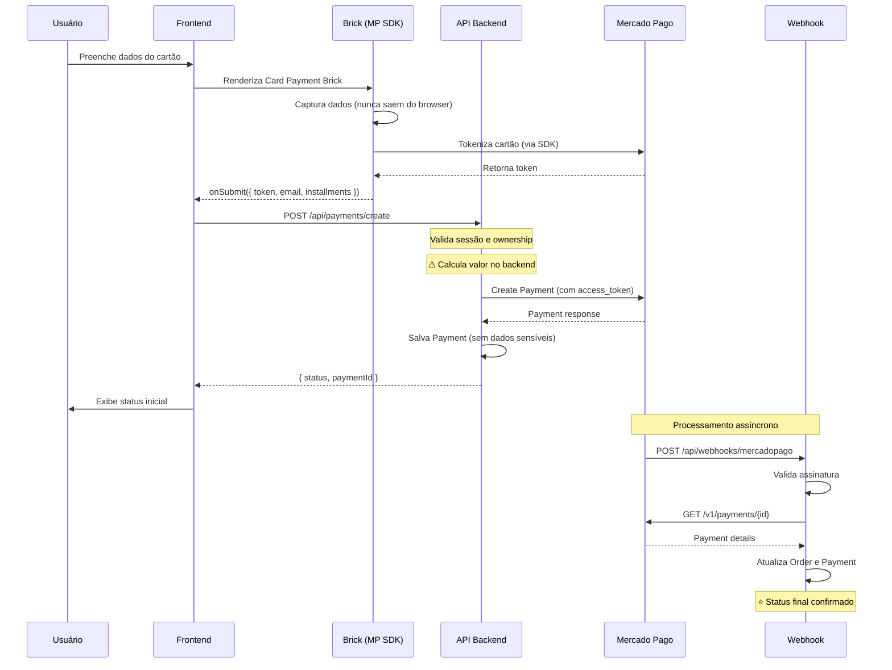

# Sistema de Pagamentos — Doende Verde

## 📐 Arquitetura

```
┌─────────────────────────────────────────────────────────────────────────────┐
│                              FRONTEND (Browser)                             │
│  ┌─────────────────────────────────────────────────────────────────────┐   │
│  │                     Card Payment Brick (MP SDK)                      │   │
│  │  - Captura dados do cartão (nunca saem do browser)                  │   │
│  │  - Gera token via SDK Mercado Pago                                  │   │
│  │  - Token expira em ~7 minutos                                       │   │
│  └───────────────────────────────┬─────────────────────────────────────┘   │
│                                  │ token + email + installments             │
└──────────────────────────────────┼─────────────────────────────────────────┘
                                   ▼
┌─────────────────────────────────────────────────────────────────────────────┐
│                              BACKEND (API Routes)                           │
│  ┌─────────────────────────────────────────────────────────────────────┐   │
│  │                    POST /api/payments/create                         │   │
│  │  1. Valida sessão do usuário                                        │   │
│  │  2. Busca pedido pelo orderId                                       │   │
│  │  3. Valida ownership (pedido pertence ao usuário)                   │   │
│  │  4. ⚠️ CALCULA VALOR NO BACKEND (nunca confiar no client)           │   │
│  │  5. Cria pagamento no Mercado Pago com access_token                 │   │
│  │  6. Salva Payment no banco (sem dados sensíveis)                    │   │
│  │  7. Retorna status inicial                                          │   │
│  └───────────────────────────────┬─────────────────────────────────────┘   │
│                                  │                                          │
└──────────────────────────────────┼─────────────────────────────────────────┘
                                   ▼
┌─────────────────────────────────────────────────────────────────────────────┐
│                           MERCADO PAGO (Externo)                            │
│  - Processa pagamento                                                       │
│  - Envia notificação via webhook                                           │
└───────────────────────────────┬─────────────────────────────────────────────┘
                                │ webhook notification
                                ▼
┌─────────────────────────────────────────────────────────────────────────────┐
│                    POST /api/webhooks/mercadopago                           │
│  1. Valida assinatura do webhook (x-signature)                             │
│  2. Busca detalhes do pagamento na API do MP                               │
│  3. Atualiza status do Payment e Order no banco                            │
│  4. Se aprovado: ativa assinatura                                          │
│  ⚠️ FONTE DA VERDADE - Frontend NUNCA decide sucesso final                 │
└─────────────────────────────────────────────────────────────────────────────┘
```

## 🔐 Regras de Segurança (OBRIGATÓRIAS)

### ❌ O que NUNCA fazer

| Item | Razão |
|------|-------|
| Enviar `ACCESS_TOKEN_MP` para o frontend | Token de autenticação deve permanecer no servidor |
| Salvar número do cartão | Violação de PCI-DSS |
| Salvar CVV | Violação de PCI-DSS |
| Salvar data de validade | Violação de PCI-DSS |
| Salvar token do cartão | Token é temporário e deve ser descartado |
| Confiar em valor vindo do client | Valor deve ser calculado no backend |
| Decidir sucesso do pagamento no frontend | Apenas webhook confirma |

### ✅ O que SEMPRE fazer

| Item | Implementação |
|------|---------------|
| Usar `PUBLIC_KEY` apenas no frontend | Variável `NEXT_PUBLIC_MP_PUBLIC_KEY` |
| Usar `ACCESS_TOKEN` apenas no backend | Variável `ACCESS_TOKEN_MP` |
| Calcular valor no backend | Buscar do pedido/assinatura no banco |
| Validar ownership | Verificar se recurso pertence ao usuário |
| Validar assinatura do webhook | HMAC SHA256 com `MP_WEBHOOK_SECRET` |
| Usar webhook como fonte da verdade | Status final sempre via webhook |

## 📁 Estrutura de Arquivos

```
app/api/
├── checkout/
│   ├── route.ts                   # Checkout de produtos avulsos
│   └── subscription/
│       └── route.ts               # ⭐ Checkout de assinatura (PIX/Cartão)
├── payments/
│   └── create/
│       └── route.ts               # Pagamento avulso (cartão)
├── webhooks/
│   └── mercadopago/
│       └── route.ts               # ⭐ Webhook do Mercado Pago

schemas/
├── payment.schema.ts              # ⭐ Validação de pagamentos (discriminated union)
└── checkout.schema.ts             # Schemas de checkout (re-export)

services/
├── mercadopago.service.ts         # ⭐ Serviço de pagamentos MP
├── checkout.service.ts            # Orquestração de checkout
└── payment.service.ts             # (Legacy) Serviço de pagamentos

components/checkout/
├── CardPaymentBrick.tsx           # Brick do MP - captura cartão
├── PixPaymentStep.tsx             # PIX com QR Code
├── OrderSummary.tsx               # Resumo do pedido
└── CheckoutForm.tsx               # Form principal
```

## 🔄 Fluxo de Checkout de Assinatura

### POST /api/checkout/subscription

Endpoint unificado para checkout de assinaturas. Suporta PIX e Cartão.

#### Request Body

```typescript
{
  planSlug: string;        // "doende-bronze" | "doende-prata" | "doende-ouro"
  addressId: string;       // UUID do endereço de entrega
  shippingOption?: {       // Opção de frete selecionada
    code: string;
    name: string;
    price: number;
    estimatedDays: number;
  };
  paymentData: PixPaymentData | CardPaymentData;
}
```

#### PIX Payment Data

```typescript
{
  method: "pix"
}
```

#### Card Payment Data

```typescript
{
  method: "credit_card" | "debit_card";
  token: string;           // Token do Checkout Bricks
  paymentMethodId: string; // "visa", "master", etc
  issuerId: number;        // ID do emissor
  installments: number;    // 1-12
  payerEmail: string;      // Email do pagador
}
```

#### Respostas

**PIX - Sucesso (200)**
```json
{
  "success": true,
  "data": {
    "orderId": "uuid",
    "paymentId": "uuid",
    "status": "pending",
    "paymentPreference": {
      "qrCode": "00020126...",
      "qrCodeBase64": "data:image/png;base64,...",
      "pixCopyPaste": "00020126...",
      "expirationDate": "2024-01-01T00:00:00Z"
    }
  }
}
```

**Cartão - Aprovado (200)**
```json
{
  "success": true,
  "data": {
    "subscriptionId": "uuid",
    "orderId": "uuid",
    "paymentId": "uuid",
    "status": "approved"
  }
}
```

**Erro (400)**
```json
{
  "success": false,
  "error": "Mensagem amigável",
  "errorCode": "ERROR_CODE",
  "details": [{ "field": "token", "message": "Token inválido" }]
}
```

## 🔄 Fluxo Detalhado

### 1. Checkout com Cartão (Brick)



### 2. Estados do Frontend

```typescript
type PaymentState = 
  | "idle"                    // Aguardando input
  | "processing"              // Enviando para API
  | "awaiting_confirmation"   // Pagamento pendente (webhook pendente)
  | "success"                 // Aprovado (status inicial)
  | "error"                   // Rejeitado ou erro
```

⚠️ **Importante**: Mesmo com `success`, o status final é confirmado pelo webhook.

## 📊 Dados por Camada

### Frontend → Backend (Permitido)

```typescript
interface CreatePaymentRequest {
  token: string;           // Token do cartão (temporário)
  email: string;           // Email do pagador
  installments: number;    // Parcelas
  orderId: string;         // ID do pedido interno
  paymentMethodId?: string;
  issuerId?: string;
  identificationType?: string;
  identificationNumber?: string;
}
```

### Backend → Banco de Dados (Salvar)

```typescript
// ✅ Campos que DEVEM ser salvos
interface PaymentRecord {
  orderId: string;
  provider: "MERCADO_PAGO";
  status: "PENDING" | "PAID" | "FAILED" | "REFUNDED";
  amount: number;          // Calculado no backend
  transactionId: string;   // ID do MP
  payload: {
    mp_id: number;
    status: string;
    status_detail: string;
    payment_method_id: string;
    payment_type_id: string;
    installments: number;
  };
  createdAt: Date;
}

// ❌ Campos que NUNCA devem ser salvos
// - token
// - card_number
// - cvv
// - expiration_date
// - card_holder_name (opcional, mas não necessário)
```

## 🔧 Configuração

### Variáveis de Ambiente

```bash
# ═══════════════════════════════════════════════════════════════════════════
# FRONTEND (exposta ao client)
# ═══════════════════════════════════════════════════════════════════════════
# Obtida em: Mercado Pago > Suas integrações > Credenciais
NEXT_PUBLIC_MP_PUBLIC_KEY=APP_USR-xxx

# ═══════════════════════════════════════════════════════════════════════════
# BACKEND (NUNCA expor)
# ═══════════════════════════════════════════════════════════════════════════
# Obtido em: Mercado Pago > Suas integrações > Credenciais
# ⚠️ Use TEST- para sandbox, APP_USR- para produção
ACCESS_TOKEN_MP=TEST-xxx  # ou APP_USR-xxx em produção

# ═══════════════════════════════════════════════════════════════════════════
# WEBHOOK (validação de assinatura)
# ═══════════════════════════════════════════════════════════════════════════
# Obtido ao configurar webhook no painel do Mercado Pago
MP_WEBHOOK_SECRET=xxx

# ═══════════════════════════════════════════════════════════════════════════
# URLS
# ═══════════════════════════════════════════════════════════════════════════
# URL base da aplicação (usado para notification_url no pagamento)
AUTH_URL=https://seudominio.com
```

### Configuração de Webhooks no Mercado Pago

#### Passo a Passo

1. **Acesse o painel de desenvolvedores**
   - URL: https://www.mercadopago.com.br/developers/panel
   - Faça login com sua conta Mercado Pago

2. **Navegue até Webhooks**
   - Clique em "Suas integrações"
   - Selecione sua aplicação
   - Vá na aba "Webhooks"

3. **Configure o endpoint**
   - Clique em "Configurar webhook"
   - **URL de produção:** `https://seudominio.com/api/webhooks/mercadopago`
   - **URL de teste:** `https://seu-ngrok-url.ngrok.io/api/webhooks/mercadopago`

4. **Selecione os eventos**
   - ✅ **payment** - Notificações de pagamento (obrigatório)
   - ⬜ subscription - Para assinaturas gerenciadas pelo MP
   - ⬜ invoice - Para faturas de assinatura

5. **Copie o Secret**
   - Após salvar, o MP mostra o `Signing Secret`
   - Copie e adicione ao `.env` como `MP_WEBHOOK_SECRET`

#### Eventos de Payment

O webhook recebe notificações para:

| Action | Quando |
|--------|--------|
| `payment.created` | Pagamento criado |
| `payment.updated` | Status atualizado |

#### Status de Pagamento

| Status MP | Status Interno | Ação |
|-----------|----------------|------|
| `approved` | `PAID` | ✅ Ativa assinatura |
| `pending` | `PENDING` | ⏳ Aguarda |
| `in_process` | `PENDING` | ⏳ Em análise |
| `rejected` | `FAILED` | ❌ Notifica usuário |
| `cancelled` | `CANCELED` | ❌ Cancela pedido |
| `refunded` | `REFUNDED` | 💰 Processa reembolso |

### Testando Webhook Localmente

#### Usando ngrok

```bash
# Instale ngrok
npm install -g ngrok

# Exponha o localhost
ngrok http 3000

# Copie a URL HTTPS (ex: https://abc123.ngrok.io)
# Configure no painel do MP como URL de teste
```

#### Simulando Webhook Manualmente

```bash
# Simule uma notificação de pagamento aprovado
curl -X POST http://localhost:3000/api/webhooks/mercadopago \
  -H "Content-Type: application/json" \
  -H "x-request-id: test-$(date +%s)" \
  -d '{
    "type": "payment",
    "action": "payment.updated",
    "data": {
      "id": "123456789"
    }
  }'
```

⚠️ **Nota:** Em desenvolvimento sem `MP_WEBHOOK_SECRET`, a validação de assinatura é ignorada.

## 🧪 Testes

### Cartões de Teste

| Número | Bandeira | Status |
|--------|----------|--------|
| 5031 4332 1540 6351 | Mastercard | Aprovado |
| 4235 6477 2802 5682 | Visa | Aprovado |
| 3753 651535 56885 | Amex | Aprovado |

- CVV: 123
- Validade: Qualquer data futura
- Nome: APRO (aprovado) ou OTHE (outros status)

### Simulando Webhook Local

Use [ngrok](https://ngrok.com/) para expor localhost:

```bash
ngrok http 3000
# Copie a URL https e configure no painel do MP
```

## 🚨 Tratamento de Erros

### Códigos de Erro do Mercado Pago

| Código | Significado | Ação do Frontend |
|--------|-------------|------------------|
| `cc_rejected_bad_filled_*` | Dados incorretos | Mostrar campo específico |
| `cc_rejected_insufficient_amount` | Saldo insuficiente | Sugerir outro cartão |
| `cc_rejected_high_risk` | Risco de fraude | Sugerir outro método |
| `cc_rejected_card_disabled` | Cartão bloqueado | Contatar banco |
| `pending_*` | Em análise | Aguardar webhook |

### Retry Policy

- Token expira em ~7 minutos → gerar novo se necessário
- Webhook pode falhar → MP reenvia automaticamente
- Idempotência: verificar se pagamento já existe antes de criar

## 📝 Checklist de Auditoria

- [ ] `ACCESS_TOKEN_MP` não aparece no bundle do frontend
- [ ] Nenhum dado de cartão é logado ou salvo
- [ ] Valor é calculado a partir do pedido no banco
- [ ] Webhook valida assinatura em produção
- [ ] Ownership é verificado antes de criar pagamento
- [ ] Status final é determinado pelo webhook, não pela resposta da API

## 🔮 Próximos Passos

1. **Assinaturas Recorrentes**
   - Usar Brick apenas para tokenização inicial
   - Criar assinatura no backend com `subscriptions` API do MP

2. **PIX**
   - Já implementado em `createPixPaymentDirect`
   - Exibir QR Code no frontend

3. **Boleto**
   - Adicionar suporte se necessário
   - Webhook atualiza quando pago

4. **Reembolsos**
   - Criar endpoint `/api/payments/refund`
   - Processar via API do MP
