# Sistema de Pagamentos — Doende Verde

## 📐 Arquitetura

```
┌─────────────────────────────────────────────────────────────────────────────┐
│                              FRONTEND (Browser)                             │
│  ┌─────────────────────────────────────────────────────────────────────┐   │
│  │                     Card Payment Brick (MP SDK)                      │   │
│  │  - Captura dados do cartão (nunca saem do browser)                  │   │
│  │  - Gera token via SDK Mercado Pago                                  │   │
│  │  - Token expira em ~7 minutos                                       │   │
│  └───────────────────────────────┬─────────────────────────────────────┘   │
│                                  │ token + email + installments             │
└──────────────────────────────────┼─────────────────────────────────────────┘
                                   ▼
┌─────────────────────────────────────────────────────────────────────────────┐
│                              BACKEND (API Routes)                           │
│  ┌─────────────────────────────────────────────────────────────────────┐   │
│  │                    POST /api/payments/create                         │   │
│  │  1. Valida sessão do usuário                                        │   │
│  │  2. Busca pedido pelo orderId                                       │   │
│  │  3. Valida ownership (pedido pertence ao usuário)                   │   │
│  │  4. ⚠️ CALCULA VALOR NO BACKEND (nunca confiar no client)           │   │
│  │  5. Cria pagamento no Mercado Pago com access_token                 │   │
│  │  6. Salva Payment no banco (sem dados sensíveis)                    │   │
│  │  7. Retorna status inicial                                          │   │
│  └───────────────────────────────┬─────────────────────────────────────┘   │
│                                  │                                          │
└──────────────────────────────────┼─────────────────────────────────────────┘
                                   ▼
┌─────────────────────────────────────────────────────────────────────────────┐
│                           MERCADO PAGO (Externo)                            │
│  - Processa pagamento                                                       │
│  - Envia notificação via webhook                                           │
└───────────────────────────────┬─────────────────────────────────────────────┘
                                │ webhook notification
                                ▼
┌─────────────────────────────────────────────────────────────────────────────┐
│                    POST /api/webhooks/mercadopago                           │
│  1. Valida assinatura do webhook (x-signature)                             │
│  2. Busca detalhes do pagamento na API do MP                               │
│  3. Atualiza status do Payment e Order no banco                            │
│  4. Se aprovado: ativa assinatura                                          │
│  ⚠️ FONTE DA VERDADE - Frontend NUNCA decide sucesso final                 │
└─────────────────────────────────────────────────────────────────────────────┘
```

## 🔐 Regras de Segurança (OBRIGATÓRIAS)

### ❌ O que NUNCA fazer

| Item | Razão |
|------|-------|
| Enviar `ACCESS_TOKEN_MP` para o frontend | Token de autenticação deve permanecer no servidor |
| Salvar número do cartão | Violação de PCI-DSS |
| Salvar CVV | Violação de PCI-DSS |
| Salvar data de validade | Violação de PCI-DSS |
| Salvar token do cartão | Token é temporário e deve ser descartado |
| Confiar em valor vindo do client | Valor deve ser calculado no backend |
| Decidir sucesso do pagamento no frontend | Apenas webhook confirma |

### ✅ O que SEMPRE fazer

| Item | Implementação |
|------|---------------|
| Usar `PUBLIC_KEY` apenas no frontend | Variável `NEXT_PUBLIC_MP_PUBLIC_KEY` |
| Usar `ACCESS_TOKEN` apenas no backend | Variável `ACCESS_TOKEN_MP` |
| Calcular valor no backend | Buscar do pedido/assinatura no banco |
| Validar ownership | Verificar se recurso pertence ao usuário |
| Validar assinatura do webhook | HMAC SHA256 com `MP_WEBHOOK_SECRET` |
| Usar webhook como fonte da verdade | Status final sempre via webhook |

## 📁 Estrutura de Arquivos

```
app/api/
├── payments/
│   ├── create/
│   │   └── route.ts        # Cria pagamento com token
│   └── webhook/
│       └── route.ts        # Webhook duplicado (manter webhooks/mercadopago)
├── webhooks/
│   └── mercadopago/
│       └── route.ts        # ⭐ Webhook principal
└── checkout/
    └── payment-preference/
        └── route.ts        # (Legacy) Checkout Pro - deprecar

components/checkout/
├── CardPaymentBrick.tsx    # Brick do MP - captura cartão
├── CardPaymentStep.tsx     # Step de pagamento com states
└── index.ts                # Barrel export

lib/
└── mercadopago.ts          # Config do SDK server-side

services/
└── payment.service.ts      # Orquestração de pagamentos
```

## 🔄 Fluxo Detalhado

### 1. Checkout com Cartão (Brick)

```mermaid
sequenceDiagram
    participant U as Usuário
    participant F as Frontend
    participant B as Brick (MP SDK)
    participant A as API Backend
    participant M as Mercado Pago
    participant W as Webhook

    U->>F: Preenche dados do cartão
    F->>B: Renderiza Card Payment Brick
    B->>B: Captura dados (nunca saem do browser)
    B->>M: Tokeniza cartão (via SDK)
    M-->>B: Retorna token
    B-->>F: onSubmit({ token, email, installments })
    F->>A: POST /api/payments/create
    Note over A: Valida sessão e ownership
    Note over A: ⚠️ Calcula valor no backend
    A->>M: Create Payment (com access_token)
    M-->>A: Payment response
    A->>A: Salva Payment (sem dados sensíveis)
    A-->>F: { status, paymentId }
    F->>U: Exibe status inicial
    
    Note over M,W: Processamento assíncrono
    M->>W: POST /api/webhooks/mercadopago
    W->>W: Valida assinatura
    W->>M: GET /v1/payments/{id}
    M-->>W: Payment details
    W->>W: Atualiza Order e Payment
    Note over W: ⭐ Status final confirmado
```



### 2. Estados do Frontend

```typescript
type PaymentState = 
  | "idle"                    // Aguardando input
  | "processing"              // Enviando para API
  | "awaiting_confirmation"   // Pagamento pendente (webhook pendente)
  | "success"                 // Aprovado (status inicial)
  | "error"                   // Rejeitado ou erro
```

⚠️ **Importante**: Mesmo com `success`, o status final é confirmado pelo webhook.

## 📊 Dados por Camada

### Frontend → Backend (Permitido)

```typescript
interface CreatePaymentRequest {
  token: string;           // Token do cartão (temporário)
  email: string;           // Email do pagador
  installments: number;    // Parcelas
  orderId: string;         // ID do pedido interno
  paymentMethodId?: string;
  issuerId?: string;
  identificationType?: string;
  identificationNumber?: string;
}
```

### Backend → Banco de Dados (Salvar)

```typescript
// ✅ Campos que DEVEM ser salvos
interface PaymentRecord {
  orderId: string;
  provider: "MERCADO_PAGO";
  status: "PENDING" | "PAID" | "FAILED" | "REFUNDED";
  amount: number;          // Calculado no backend
  transactionId: string;   // ID do MP
  payload: {
    mp_id: number;
    status: string;
    status_detail: string;
    payment_method_id: string;
    payment_type_id: string;
    installments: number;
  };
  createdAt: Date;
}

// ❌ Campos que NUNCA devem ser salvos
// - token
// - card_number
// - cvv
// - expiration_date
// - card_holder_name (opcional, mas não necessário)
```

## 🔧 Configuração

### Variáveis de Ambiente

```bash
# Frontend (exposta ao client)
NEXT_PUBLIC_MP_PUBLIC_KEY=APP_USR-xxx

# Backend (NUNCA expor)
ACCESS_TOKEN_MP=APP_USR-xxx

# Webhook (validação de assinatura)
MP_WEBHOOK_SECRET=xxx

# URLs
AUTH_URL=https://seudominio.com
```

### Webhook no Painel do Mercado Pago

1. Acesse: Suas integrações → Webhooks
2. URL: `https://seudominio.com/api/webhooks/mercadopago`
3. Eventos: `payment`
4. Copie o Secret para `MP_WEBHOOK_SECRET`

## 🧪 Testes

### Cartões de Teste

| Número | Bandeira | Status |
|--------|----------|--------|
| 5031 4332 1540 6351 | Mastercard | Aprovado |
| 4235 6477 2802 5682 | Visa | Aprovado |
| 3753 651535 56885 | Amex | Aprovado |

- CVV: 123
- Validade: Qualquer data futura
- Nome: APRO (aprovado) ou OTHE (outros status)

### Simulando Webhook Local

Use [ngrok](https://ngrok.com/) para expor localhost:

```bash
ngrok http 3000
# Copie a URL https e configure no painel do MP
```

## 🚨 Tratamento de Erros

### Códigos de Erro do Mercado Pago

| Código | Significado | Ação do Frontend |
|--------|-------------|------------------|
| `cc_rejected_bad_filled_*` | Dados incorretos | Mostrar campo específico |
| `cc_rejected_insufficient_amount` | Saldo insuficiente | Sugerir outro cartão |
| `cc_rejected_high_risk` | Risco de fraude | Sugerir outro método |
| `cc_rejected_card_disabled` | Cartão bloqueado | Contatar banco |
| `pending_*` | Em análise | Aguardar webhook |

### Retry Policy

- Token expira em ~7 minutos → gerar novo se necessário
- Webhook pode falhar → MP reenvia automaticamente
- Idempotência: verificar se pagamento já existe antes de criar

## 📝 Checklist de Auditoria

- [ ] `ACCESS_TOKEN_MP` não aparece no bundle do frontend
- [ ] Nenhum dado de cartão é logado ou salvo
- [ ] Valor é calculado a partir do pedido no banco
- [ ] Webhook valida assinatura em produção
- [ ] Ownership é verificado antes de criar pagamento
- [ ] Status final é determinado pelo webhook, não pela resposta da API

## 🔮 Próximos Passos

1. **Assinaturas Recorrentes**
   - Usar Brick apenas para tokenização inicial
   - Criar assinatura no backend com `subscriptions` API do MP

2. **PIX**
   - Já implementado em `createPixPaymentDirect`
   - Exibir QR Code no frontend

3. **Boleto**
   - Adicionar suporte se necessário
   - Webhook atualiza quando pago

4. **Reembolsos**
   - Criar endpoint `/api/payments/refund`
   - Processar via API do MP
