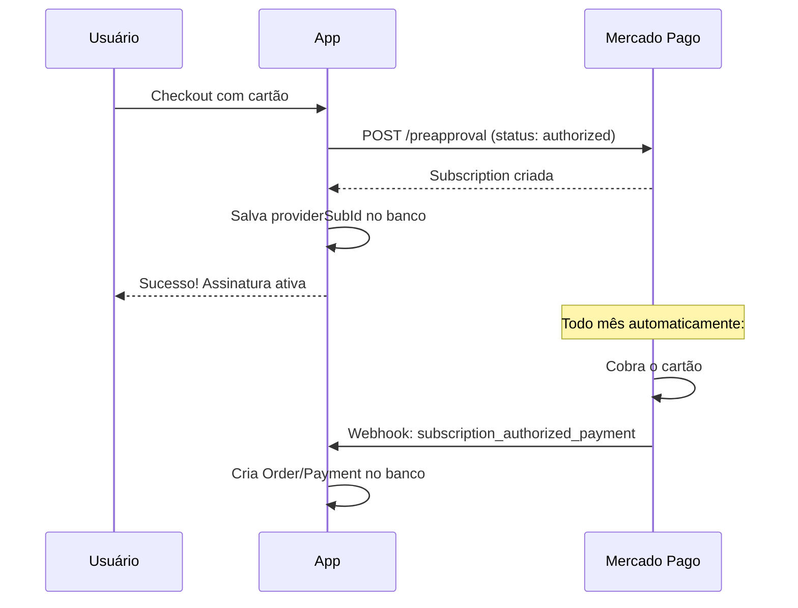

# 🧪 Guia de Teste do Sistema de Assinaturas com Preapproval

## Resumo das Mudanças Implementadas

### ❌ O que estava ERRADO (implementação anterior)
- O checkout de assinatura usava **Preferences API** (Checkout Pro)
- Criava pagamentos **únicos** - o MP **NÃO** cobrava automaticamente
- Precisávamos cobrar manualmente todo mês 😱

### ✅ O que foi CORRIGIDO (implementação atual)
- Agora usa **Preapproval API** (Subscriptions)
- Cria assinaturas **recorrentes** - o MP **COBRA AUTOMATICAMENTE**
- Gerenciamento automático de cobranças, falhas e cancelamentos 🎉

---

## 📁 Arquivos Criados/Modificados

### Novos Arquivos
| Arquivo | Descrição |
|---------|-----------|
| `lib/mercadopago-subscriptions.ts` | Wrapper completo da API de Preapproval |
| `services/subscription-mp.service.ts` | Serviço de gestão de assinaturas recorrentes |
| `scripts/test-preapproval.ts` | Script para testar e listar assinaturas |
| `docs/PREAPPROVAL_TESTING.md` | Este documento |

### Arquivos Modificados
| Arquivo | Mudança |
|---------|---------|
| `app/api/checkout/subscription/route.ts` | Agora usa Preapproval para cartão |
| `app/api/webhooks/mercadopago/route.ts` | Processa subscription_authorized_payment |

---

## 🚀 Passo a Passo para Testar

### Passo 1: Configurar Variáveis de Ambiente

```env
# .env
MP_ACCESS_TOKEN=TEST-xxxx-your-access-token
MP_PUBLIC_KEY=TEST-xxxx-your-public-key
WEBHOOK_NGROK_URL=https://your-ngrok-url.ngrok-free.app
```

### Passo 2: Criar Usuários de Teste

1. Acesse: https://www.mercadopago.com.br/developers/panel/test-users
2. Crie **dois** usuários:
   - **Vendedor** (seller) - já tem na sua conta de desenvolvedor
   - **Comprador** (buyer) - para simular compras

3. Anote as credenciais do comprador:
   - Email
   - Senha

### Passo 3: Configurar Webhook

1. Inicie um túnel ngrok:
```bash
ngrok http 3000
```

2. Copie a URL gerada (ex: `https://abc123.ngrok-free.app`)

3. Acesse: https://www.mercadopago.com.br/developers/panel/app

4. Configure a URL do webhook:
   - URL: `https://abc123.ngrok-free.app/api/webhooks/mercadopago`
   - Eventos a assinar:
     - ✅ `payment`
     - ✅ `subscription_authorized_payment`
     - ✅ `subscription_preapproval`

### Passo 4: Iniciar o Servidor

```bash
npm run dev
```

### Passo 5: Testar Fluxo de Assinatura

#### 5.1 Acesse a aplicação
- URL: http://localhost:3000

#### 5.2 Faça login com usuário de teste
- Use as credenciais do usuário comprador criado no Passo 2

#### 5.3 Navegue para assinaturas
- URL: http://localhost:3000/subscriptions
- Selecione um plano

#### 5.4 Preencha o formulário de pagamento
Use os dados de cartão de teste:

**Cartão APROVADO:**
```
Número: 5031 4332 1540 6351
CVV: 123
Validade: 11/25
Nome no cartão: APRO
CPF: 12345678909
```

**Cartão REJEITADO (para testar falhas):**
```
Número: 5031 4332 1540 6351
CVV: 123
Validade: 11/25
Nome no cartão: OTHE
CPF: 12345678909
```

#### 5.5 Complete o checkout
- Submeta o formulário
- Aguarde a resposta

### Passo 6: Verificar Resultado

#### 6.1 No Terminal
Você verá logs como:
```
📋 Processando checkout de assinatura (PREAPPROVAL)
✅ Subscription criada via Preapproval: 2c93808496xxxxx
```

#### 6.2 No Banco de Dados
```bash
npx prisma studio
```
Verifique:
- Tabela `Subscription`: deve ter registro com `providerSubId`
- Tabela `Order`: deve ter pedido relacionado

#### 6.3 Via Script de Teste
```bash
npx tsx scripts/test-preapproval.ts
```
Lista todas as assinaturas na sua conta MP.

#### 6.4 No Painel do Mercado Pago
- https://www.mercadopago.com.br/subscriptions
- Deve mostrar a assinatura criada

---

## 🔄 Fluxo de Pagamento Recorrente

### Como funciona AGORA:



### Estados da Assinatura

| Status MP | Status Local | Significado |
|-----------|--------------|-------------|
| `authorized` | `ACTIVE` | Ativa, cobranças automáticas |
| `paused` | `PAUSED` | Pausada, sem cobranças |
| `cancelled` | `CANCELED` | Cancelada permanentemente |
| `pending` | `PAUSED` | Aguardando ação do usuário |

---

## 🧩 API do Preapproval

### Endpoints Implementados

```typescript
// lib/mercadopago-subscriptions.ts

// Criar assinatura recorrente
createPreapproval(request: CreatePreapprovalRequest)

// Buscar detalhes
getPreapproval(preapprovalId: string)

// Pausar assinatura
pausePreapproval(preapprovalId: string)

// Retomar assinatura
resumePreapproval(preapprovalId: string)

// Cancelar assinatura
cancelPreapproval(preapprovalId: string)

// Buscar por external_reference
searchPreapprovalsByExternalReference(externalReference: string)
```

### Request de Criação

```typescript
{
  reason: "Plano Premium - Doende Verde",
  auto_recurring: {
    frequency: 1,
    frequency_type: "months",
    transaction_amount: 99.90,
    currency_id: "BRL",
  },
  back_url: "https://site.com/subscriptions",
  external_reference: "sub_xxxxx_user_xxxxx",
  payer_email: "test@test.com",
  card_token_id: "card_token_from_mp_js",
  status: "authorized" // ← Cobra imediatamente
}
```

---

## ⚠️ Limitações do Ambiente de Teste

1. **Cobranças automáticas**: O MP **NÃO** realiza cobranças automáticas em ambiente de teste
2. **Para simular**: Use o painel de desenvolvedor ou scripts
3. **Webhooks**: Funcionam normalmente com ngrok

---

## 🔧 Comandos Úteis

```bash
# Listar assinaturas no MP
npx tsx scripts/test-preapproval.ts

# Verificar banco
npx prisma studio

# Logs do servidor
npm run dev

# Expor servidor via ngrok
ngrok http 3000
```

---

## 📊 Checklist de Teste

- [ ] Variáveis de ambiente configuradas
- [ ] Usuário de teste criado no MP
- [ ] ngrok rodando e webhook configurado
- [ ] Servidor local iniciado
- [ ] Login com usuário de teste
- [ ] Checkout de assinatura com cartão
- [ ] Verificar `providerSubId` no banco
- [ ] Verificar assinatura no painel MP
- [ ] Testar cancelamento
- [ ] Testar reativação

---

## 🆘 Troubleshooting

### Erro: "card_token_id is required"
**Causa**: O formulário não está gerando o token do cartão
**Solução**: Verifique se o SDK do MP está carregado corretamente

### Erro: "payer_email is required"
**Causa**: Email do pagador não foi passado
**Solução**: Verifique se o email está sendo extraído do perfil

### Erro: 401 Unauthorized
**Causa**: Access token inválido
**Solução**: Verifique MP_ACCESS_TOKEN no .env

### Assinatura criada mas não aparece no painel
**Causa**: Ambiente de teste tem limitações
**Solução**: Use a API diretamente ou scripts para verificar

### Webhook não recebido
**Causa**: URL não está acessível ou eventos não configurados
**Solução**: Verifique ngrok e configuração no painel MP

---

## 📚 Referências

- [Documentação Subscriptions MP](https://www.mercadopago.com.br/developers/pt/docs/subscriptions)
- [API Preapproval Reference](https://www.mercadopago.com.br/developers/pt/reference/subscriptions/_preapproval/post)
- [Webhooks de Subscriptions](https://www.mercadopago.com.br/developers/pt/docs/subscriptions/additional-content/your-integrations/notifications/webhooks)
