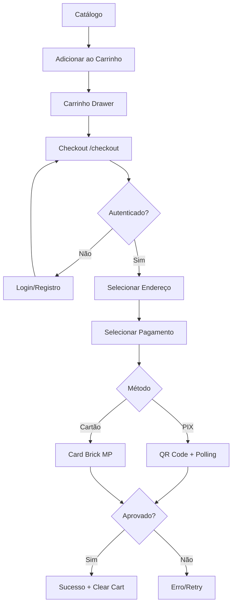
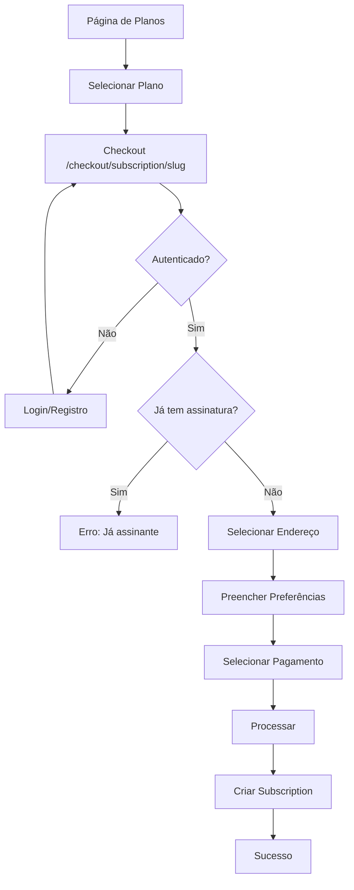

# 📚 DoendeVerde E-commerce - Documentação Completa

> **Versão:** 1.0.0  
> **Última atualização:** Janeiro 2026  
> **Status:** Em desenvolvimento

---

## 📑 Índice

1. [Visão Geral](#1-visão-geral)
2. [Stack Tecnológico](#2-stack-tecnológico)
3. [Estrutura do Projeto](#3-estrutura-do-projeto)
4. [Mapa de Rotas (Frontend)](#4-mapa-de-rotas-frontend)
5. [Mapa de API Routes](#5-mapa-de-api-routes)
6. [Layouts e Grupos de Rotas](#6-layouts-e-grupos-de-rotas)
7. [Componentes](#7-componentes)
8. [Services e Repositories](#8-services-e-repositories)
9. [Autenticação e Autorização](#9-autenticação-e-autorização)
10. [Sistema de Pagamentos](#10-sistema-de-pagamentos)
11. [Fluxos de Negócio](#11-fluxos-de-negócio)
12. [Models do Banco de Dados](#12-models-do-banco-de-dados)
13. [Problemas Identificados](#13-problemas-identificados)
14. [Funcionalidades Faltantes](#14-funcionalidades-faltantes)
15. [Roadmap de Melhorias](#15-roadmap-de-melhorias)
16. [Guia de Contribuição](#16-guia-de-contribuição)

---

## 1. Visão Geral

### 1.1 Descrição do Projeto

**DoendeVerde** é uma plataforma de e-commerce especializada em headshop com sistema de assinaturas recorrentes. O projeto foca em personalização profunda baseada nas preferências do usuário.

### 1.2 Características Principais

- ✅ E-commerce de produtos físicos
- ✅ Sistema de assinaturas recorrentes
- ✅ Personalização baseada em preferências do usuário
- ✅ Checkout com Mercado Pago (PIX + Cartão)
- ✅ Autenticação com credentials e OAuth (Google, GitHub)
- ⏳ Painel administrativo (em desenvolvimento)
- ⏳ Sistema de pontos/fidelidade (planejado)

### 1.3 Princípios Arquiteturais

- **Clean Architecture:** Separação clara entre domain, services, repositories e API
- **Single Source of Truth:** Enums e regras de negócio centralizados
- **Predictability over Cleverness:** Código explícito e legível
- **No Marketplace:** Todas as vendas são first-party, sem sellers ou comissões

---

## 2. Stack Tecnológico

### 2.1 Frontend

| Tecnologia | Versão | Uso |
|------------|--------|-----|
| Next.js | 16.x | Framework React com App Router |
| React | 19.x | Biblioteca UI |
| TypeScript | 5.x | Tipagem estática |
| Tailwind CSS | 4.x | Estilização |
| Lucide React | - | Ícones |
| Zustand | - | Gerenciamento de estado |
| Zod | - | Validação de schemas |

### 2.2 Backend

| Tecnologia | Uso |
|------------|-----|
| Next.js API Routes | Endpoints REST |
| Prisma | ORM para PostgreSQL |
| Auth.js (NextAuth) | Autenticação |
| Mercado Pago SDK | Pagamentos |

### 2.3 Banco de Dados

| Tecnologia | Uso |
|------------|-----|
| PostgreSQL | Banco de dados principal |
| Prisma Migrations | Versionamento de schema |

### 2.4 Infraestrutura

| Tecnologia | Uso |
|------------|-----|
| Vercel (recomendado) | Hospedagem |
| Neon/Supabase | PostgreSQL serverless |

---

## 3. Estrutura do Projeto

```
DoendeVerdeEcommerce/
├── app/                          # Next.js App Router
│   ├── (auth)/                   # Grupo: páginas de autenticação
│   │   ├── layout.tsx
│   │   ├── login/page.tsx
│   │   └── register/page.tsx
│   ├── (default)/                # Grupo: páginas públicas do e-commerce
│   │   ├── layout.tsx
│   │   ├── page.tsx              # Home
│   │   ├── products/
│   │   ├── checkout/
│   │   └── subscriptions/
│   ├── (protected)/              # Grupo: páginas autenticadas
│   │   ├── layout.tsx
│   │   ├── dashboard/
│   │   ├── profile/
│   │   ├── orders/
│   │   └── subscriptions/
│   ├── api/                      # API Routes
│   │   ├── auth/
│   │   ├── cart/
│   │   ├── checkout/
│   │   ├── products/
│   │   ├── user/
│   │   └── webhooks/
│   ├── globals.css
│   └── layout.tsx                # Root layout
├── components/                   # Componentes React
│   ├── auth/
│   ├── cart/
│   ├── checkout/
│   ├── layout/
│   ├── products/
│   ├── providers/
│   └── ui/
├── lib/                          # Utilitários e configurações
│   ├── auth.ts                   # Configuração Auth.js
│   ├── prisma.ts                 # Cliente Prisma
│   ├── mercadopago.ts            # SDK Mercado Pago
│   └── utils.ts
├── services/                     # Lógica de negócio
│   ├── cart.service.ts
│   ├── checkout.service.ts
│   ├── payment.service.ts
│   ├── product.service.ts
│   └── subscription.service.ts
├── repositories/                 # Acesso a dados (Prisma)
│   ├── address.repository.ts
│   ├── cart.repository.ts
│   ├── category.repository.ts
│   ├── order.repository.ts
│   ├── payment.repository.ts
│   ├── preferences.repository.ts
│   ├── product.repository.ts
│   └── subscription.repository.ts
├── schemas/                      # Validação Zod
│   ├── auth.schema.ts
│   ├── cart.schema.ts
│   └── product.schema.ts
├── stores/                       # Zustand stores
│   ├── authModal.ts
│   └── cart.ts
├── types/                        # TypeScript types
│   ├── cart.ts
│   ├── checkout.ts
│   ├── index.ts
│   └── product.ts
├── prisma/
│   ├── schema.prisma             # Schema do banco
│   ├── seed.ts                   # Seeds
│   └── migrations/
├── public/                       # Assets estáticos
├── docs/                         # Documentação
├── middleware.ts                 # Middleware de rotas
├── next.config.ts
├── tailwind.config.ts
└── tsconfig.json
```

---

## 4. Mapa de Rotas (Frontend)

### 4.1 Páginas Públicas (default)

| Path | Tipo | Descrição | Componentes Principais |
|------|------|-----------|------------------------|
| `/` | Server | Home page com produtos em destaque | `ProductCard`, `CategoryGrid`, `HeroBanner` |
| `/products` | Server | Catálogo de produtos com filtros | `ProductCatalog`, `ProductFilters`, `SearchBar` |
| `/products/[slug]` | Server | Página de detalhe do produto | `ProductImageGallery`, `AddToCartButton`, `ProductCard` |
| `/subscriptions` | Server | Listagem de planos de assinatura | `SubscriptionPlans`, `PlanCard` |
| `/checkout` | Server | Checkout de produtos do carrinho | `ProductCheckoutClient`, `CheckoutCartSummary` |
| `/checkout/subscription/[slug]` | Server | Checkout de assinatura | `SubscriptionCheckoutClient`, `OrderSummary` |
| `/checkout/payment/success` | Client | Confirmação de pagamento aprovado | - |
| `/checkout/payment/failure` | Client | Página de pagamento recusado | - |
| `/checkout/payment/pending` | Client | Página de pagamento pendente | - |

### 4.2 Páginas de Autenticação (auth)

| Path | Tipo | Descrição | Componentes |
|------|------|-----------|-------------|
| `/login` | Server | Página de login | `LoginForm`, `OAuthButtons` |
| `/register` | Server | Página de cadastro | `RegisterForm`, `OAuthButtons` |

### 4.3 Páginas Protegidas (protected)

| Path | Tipo | Auth | Descrição |
|------|------|------|-----------|
| `/dashboard` | Server | ✅ | Dashboard do usuário com resumo |
| `/profile` | Server | ✅ | Edição de perfil e preferências |
| `/orders` | Server | ✅ | Histórico de pedidos |
| `/subscriptions` | Server | ✅ | Gerenciamento de assinatura ativa |

---

## 5. Mapa de API Routes

### 5.1 Autenticação

| Endpoint | Método | Auth | Descrição |
|----------|--------|------|-----------|
| `/api/auth/[...nextauth]` | GET, POST | ❌ | Handlers do Auth.js (login, logout, OAuth) |
| `/api/register` | POST | ❌ | Registro de novo usuário |

**POST /api/register**
```typescript
// Request
{
  name: string;
  email: string;
  password: string;
  birthDate: string; // YYYY-MM-DD, deve ser 18+
}

// Response
{ success: true; user: { id, name, email } }
// ou
{ success: false; error: string }
```

### 5.2 Produtos

| Endpoint | Método | Auth | Descrição |
|----------|--------|------|-----------|
| `/api/products` | GET | ❌ | Listar produtos com filtros e paginação |
| `/api/products/[slug]` | GET | ❌ | Detalhes de um produto específico |
| `/api/categories` | GET | ❌ | Listar categorias ativas |

**GET /api/products**
```typescript
// Query params
?page=1
&limit=12
&category=slug
&search=termo
&sort=price_asc|price_desc|newest
&minPrice=0
&maxPrice=1000

// Response
{
  success: true;
  data: {
    products: Product[];
    pagination: { page, limit, total, totalPages };
  }
}
```

### 5.3 Carrinho

| Endpoint | Método | Auth | Descrição |
|----------|--------|------|-----------|
| `/api/cart` | GET | ✅ | Buscar carrinho do usuário |
| `/api/cart` | POST | ✅ | Adicionar item ao carrinho |
| `/api/cart` | DELETE | ✅ | Limpar carrinho |
| `/api/cart/items/[itemId]` | PATCH | ✅ | Atualizar quantidade do item |
| `/api/cart/items/[itemId]` | DELETE | ✅ | Remover item do carrinho |

**POST /api/cart**
```typescript
// Request
{
  productId: string;
  variantId?: string;
  quantity: number;
}

// Response
{ success: true; data: Cart }
```

### 5.4 Usuário

| Endpoint | Método | Auth | Descrição |
|----------|--------|------|-----------|
| `/api/user/addresses` | GET | ✅ | Listar endereços do usuário |
| `/api/user/addresses` | POST | ✅ | Criar novo endereço |
| `/api/user/addresses/[addressId]` | GET | ✅ | Buscar endereço específico |
| `/api/user/addresses/[addressId]` | PATCH | ✅ | Atualizar endereço |
| `/api/user/addresses/[addressId]` | DELETE | ✅ | Remover endereço |
| `/api/user/preferences` | GET | ✅ | Buscar preferências |
| `/api/user/preferences` | POST | ✅ | Criar preferências |
| `/api/user/preferences` | PATCH | ✅ | Atualizar preferências |
| `/api/user/subscription` | GET | ✅ | Buscar assinatura ativa |

**POST /api/user/addresses**
```typescript
// Request
{
  label?: string;
  street: string;
  number: string;
  complement?: string;
  neighborhood: string;
  city: string;
  state: string;
  zipCode: string;
  country?: string;
  isDefault?: boolean;
}
```

### 5.5 Assinaturas

| Endpoint | Método | Auth | Descrição |
|----------|--------|------|-----------|
| `/api/subscriptions/plans` | GET | ❌ | Listar planos de assinatura |

### 5.6 Checkout

| Endpoint | Método | Auth | Descrição |
|----------|--------|------|-----------|
| `/api/checkout/cart` | POST | ✅ | Processar checkout de carrinho |
| `/api/checkout/subscription` | POST | ✅ | Processar checkout de assinatura |
| `/api/checkout/payment-preference` | POST | ✅ | Criar preferência Mercado Pago |
| `/api/checkout/payment-status/[paymentId]` | GET | ✅ | Verificar status do pagamento |

**POST /api/checkout/cart**
```typescript
// Request
{
  addressId: string;
  paymentData: {
    method: "pix" | "credit_card" | "debit_card";
    cardToken?: string;      // Para cartão
    cardBrand?: string;      // Para cartão
    installments?: number;   // Para cartão
  }
}

// Response
{
  success: true;
  data: {
    orderId: string;
    status: "pending" | "approved" | "rejected";
    paymentPreference?: PixPaymentData; // Para PIX
  }
}
```

### 5.7 Pagamentos

| Endpoint | Método | Auth | Descrição |
|----------|--------|------|-----------|
| `/api/payments/create` | POST | ✅ | Criar pagamento via Card Brick |
| `/api/webhooks/mercadopago` | POST | ❌ | Webhook do Mercado Pago |

---

## 6. Layouts e Grupos de Rotas

### 6.1 Root Layout (`app/layout.tsx`)

**Responsabilidades:**
- Configuração de fontes (Geist Sans/Mono)
- Providers globais (SessionProvider)
- Componentes globais (Toaster, AuthModal, CartDrawer)

```tsx
<html>
  <body>
    <SessionProvider>
      <Toaster />
      <AuthModal />
      <CartDrawer />
      {children}
    </SessionProvider>
  </body>
</html>
```

### 6.2 Auth Layout (`app/(auth)/layout.tsx`)

**Páginas:** `/login`, `/register`

**Características:**
- Fundo com gradiente
- Card centralizado
- Redireciona para `/dashboard` se já autenticado

### 6.3 Default Layout (`app/(default)/layout.tsx`)

**Páginas:** `/`, `/products/*`, `/checkout/*`, `/subscriptions`

**Componentes:**
- `Header` - Navegação fixa com logo, menu, carrinho, usuário
- `ConditionalSubscriptionBanner` - Banner de assinatura (oculto no checkout)

```tsx
<div className="min-h-screen bg-gray-bg">
  <Header />
  <main>
    <ConditionalSubscriptionBanner />
    {children}
  </main>
</div>
```

### 6.4 Protected Layout (`app/(protected)/layout.tsx`)

**Páginas:** `/dashboard`, `/profile`, `/orders`, `/subscriptions`

**Características:**
- Verifica sessão via `auth()`
- Redireciona para `/login` se não autenticado
- Navbar própria com links internos e logout

---

## 7. Componentes

### 7.1 Auth (`components/auth/`)

| Componente | Tipo | Descrição |
|------------|------|-----------|
| `AuthModal` | Client | Modal global de login/registro. Controlado via Zustand. |
| `LoginForm` | Client | Formulário de login com validação Zod |
| `RegisterForm` | Client | Formulário de cadastro com validação Zod |
| `OAuthButtons` | Client | Botões de login social (Google, GitHub) |

### 7.2 Cart (`components/cart/`)

| Componente | Tipo | Descrição |
|------------|------|-----------|
| `CartDrawer` | Client | Drawer lateral com lista de itens do carrinho |
| `CartItem` | Client | Item individual com controles de quantidade |
| `CartSummary` | Client | Resumo com subtotal e botão de checkout |

### 7.3 Checkout (`components/checkout/`)

| Componente | Tipo | Descrição |
|------------|------|-----------|
| `CardPaymentBrick` | Client | Integração com Checkout Bricks do MP |
| `CardPaymentStep` | Client | Step de pagamento com cartão |
| `CheckoutProgressGeneric` | Client | Indicador de progresso parametrizável |
| `CheckoutStates` | Client | Estados: Processing, Success, Error |

#### Subscription Checkout (`components/checkout/subscription/`)

| Componente | Tipo | Descrição |
|------------|------|-----------|
| `AddressStep` | Client | Seleção/criação de endereço |
| `PaymentStep` | Client | Seleção de método de pagamento |
| `PixWaitingStep` | Client | QR Code PIX com polling de status |
| `PreferencesStep` | Client | Coleta de preferências do usuário |
| `OrderSummary` | Client | Resumo do pedido de assinatura |

### 7.4 Layout (`components/layout/`)

| Componente | Tipo | Descrição |
|------------|------|-----------|
| `Header` | Server | Header fixo com navegação |
| `Navbar` | Client | Menu de navegação principal |
| `Logo` | Server | Logo da marca |
| `CartButton` | Client | Botão do carrinho com contador |
| `UserDropdown` | Client | Menu dropdown do usuário |
| `MobileMenu` | Client | Menu hamburguer mobile |
| `SubscriptionBanner` | Client | Orquestrador do banner |
| `UserStatusBanner` | Client | Mostra status do plano atual |
| `SubscriptionCTABanner` | Client | Carousel de planos (CTA) |
| `ConditionalSubscriptionBanner` | Client | Wrapper que oculta em checkout |

### 7.5 Products (`components/products/`)

| Componente | Tipo | Descrição |
|------------|------|-----------|
| `ProductCard` | Client | Card de produto com add to cart |
| `ProductGrid` | Server | Grid responsivo de produtos |
| `ProductFilters` | Client | Filtros do catálogo |
| `ProductImageGallery` | Client | Galeria de imagens do produto |
| `AddToCartButton` | Client | Botão inteligente de add to cart |
| `CategoryChips` | Client | Chips de categorias |
| `CategoryGrid` | Server | Grid de categorias |
| `SearchBar` | Client | Barra de busca |

---

## 8. Services e Repositories

### 8.1 Services (`services/`)

| Service | Responsabilidade |
|---------|------------------|
| `product.service.ts` | Busca de produtos, filtros, produtos relacionados |
| `cart.service.ts` | CRUD do carrinho, validação de estoque |
| `checkout.service.ts` | Orquestração do checkout, criação de pedido |
| `subscription.service.ts` | Lógica de assinaturas, status do usuário |
| `payment.service.ts` | Integração Mercado Pago, preferências PIX |

**Exemplo de uso:**
```typescript
// API Route
import { productService } from "@/services";

export async function GET(request: Request) {
  const products = await productService.findMany({ category: "pipes" });
  return Response.json({ success: true, data: products });
}
```

### 8.2 Repositories (`repositories/`)

| Repository | Models |
|------------|--------|
| `product.repository.ts` | `Product`, `ProductImage`, `ProductVariant` |
| `category.repository.ts` | `Category` |
| `cart.repository.ts` | `Cart`, `CartItem` |
| `order.repository.ts` | `Order`, `OrderItem`, `OrderAddressSnapshot` |
| `payment.repository.ts` | `Payment` |
| `subscription.repository.ts` | `SubscriptionPlan`, `Subscription`, `SubscriptionCycle` |
| `address.repository.ts` | `Address` |
| `preferences.repository.ts` | `UserPreferences` |

**Padrão de Repository:**
```typescript
// repositories/product.repository.ts
export async function findMany(filters: ProductFilters) {
  return prisma.product.findMany({
    where: buildWhereClause(filters),
    include: { images: true, category: true },
  });
}

export async function findBySlug(slug: string) {
  return prisma.product.findUnique({
    where: { slug },
    include: { images: true, variants: true },
  });
}
```

---

## 9. Autenticação e Autorização

### 9.1 Configuração Auth.js

**Arquivo:** `lib/auth.ts`

**Providers:**
- Credentials (email/senha)
- Google OAuth
- GitHub OAuth

**Callbacks:**
- `jwt`: Adiciona `id`, `role`, `isBlocked` ao token
- `session`: Expõe dados do token na sessão

### 9.2 Middleware de Proteção

**Arquivo:** `middleware.ts`

**Rotas Protegidas:**
```typescript
const protectedRoutes = ["/dashboard", "/profile", "/orders", "/subscriptions"];
```

**Funcionalidades:**
1. Verifica token JWT
2. Redireciona para login se não autenticado
3. Redireciona usuários bloqueados
4. Redireciona usuários logados em `/login`, `/register`

### 9.3 Proteção em API Routes

```typescript
import { auth } from "@/lib/auth";

export async function GET() {
  const session = await auth();
  
  if (!session?.user?.id) {
    return Response.json({ error: "Unauthorized" }, { status: 401 });
  }
  
  // Continua...
}
```

---

## 10. Sistema de Pagamentos

### 10.1 Mercado Pago Integration

**Métodos Suportados:**
- ✅ PIX (instantâneo)
- ✅ Cartão de Crédito (até 12x para produtos, 1x para assinaturas)
- ✅ Cartão de Débito

### 10.2 Fluxo PIX

```
1. Cliente seleciona PIX
2. Frontend chama POST /api/checkout/cart
3. Backend cria Order (status: PENDING)
4. Backend cria Payment no MP (PIX)
5. Backend retorna QR Code e dados
6. Frontend exibe PixWaitingStep
7. Frontend faz polling em /api/checkout/payment-status/[id]
8. Webhook MP notifica pagamento
9. Backend atualiza Order e Payment
10. Frontend detecta aprovação e mostra sucesso
```

### 10.3 Fluxo Cartão

```
1. Cliente seleciona Cartão
2. Frontend renderiza CardPaymentBrick (MP)
3. Usuário preenche dados do cartão
4. MP tokeniza cartão no frontend
5. Frontend envia token para backend
6. Backend processa pagamento no MP
7. Backend cria Order (status baseado no resultado)
8. Frontend mostra resultado
```

### 10.4 Webhook Mercado Pago

**Endpoint:** `POST /api/webhooks/mercadopago`

**Validação:**
- Verifica assinatura HMAC do MP
- Processa eventos: `payment.created`, `payment.updated`

**Ações:**
- Atualiza status do Payment
- Atualiza status do Order
- Decrementa estoque (se aprovado)
- Limpa carrinho (se aprovado)

---

## 11. Fluxos de Negócio

### 11.1 Fluxo de Compra de Produto



### 11.2 Fluxo de Assinatura



### 11.3 Fluxo de Carrinho Abandonado

```
1. Usuário adiciona itens ao carrinho
2. Carrinho é persistido no banco (Cart + CartItem)
3. Usuário sai sem completar compra
4. [PENDENTE] Job verifica carrinhos abandonados (>24h)
5. [PENDENTE] Marca carrinho como abandonado
6. [PENDENTE] Envia email de recuperação
```

---

## 12. Models do Banco de Dados

### 12.1 Usuário e Autenticação

```prisma
model User {
  id            String    @id @default(uuid())
  name          String?
  email         String    @unique
  emailVerified DateTime?
  passwordHash  String?
  image         String?
  role          UserRole  @default(CUSTOMER)
  isBlocked     Boolean   @default(false)
  birthDate     DateTime?
  loyaltyPoints Int       @default(0)
  createdAt     DateTime  @default(now())
  updatedAt     DateTime  @updatedAt
  
  profile       UserProfile?
  preferences   UserPreferences?
  addresses     Address[]
  orders        Order[]
  subscriptions Subscription[]
  cart          Cart?
}

enum UserRole {
  CUSTOMER
  ADMIN
}
```

### 12.2 Produtos

```prisma
model Product {
  id          String   @id @default(uuid())
  name        String
  slug        String   @unique
  description String?
  price       Decimal
  comparePrice Decimal?
  sku         String?  @unique
  stock       Int      @default(0)
  isActive    Boolean  @default(true)
  categoryId  String?
  
  category    Category?
  images      ProductImage[]
  variants    ProductVariant[]
}

model ProductVariant {
  id        String  @id @default(uuid())
  productId String
  name      String
  sku       String? @unique
  price     Decimal
  stock     Int     @default(0)
  
  product   Product @relation(...)
}
```

### 12.3 Pedidos

```prisma
model Order {
  id              String      @id @default(uuid())
  userId          String
  status          OrderStatus @default(PENDING)
  subtotal        Decimal
  shipping        Decimal     @default(0)
  discount        Decimal     @default(0)
  total           Decimal
  subscriptionId  String?
  createdAt       DateTime    @default(now())
  
  user            User        @relation(...)
  items           OrderItem[]
  payments        Payment[]
  shipment        Shipment?
  addressSnapshot OrderAddressSnapshot?
}

enum OrderStatus {
  PENDING
  CONFIRMED
  PROCESSING
  SHIPPED
  DELIVERED
  CANCELED
  REFUNDED
}
```

### 12.4 Assinaturas

```prisma
model SubscriptionPlan {
  id          String   @id @default(uuid())
  name        String
  slug        String   @unique
  description String?
  price       Decimal
  interval    SubscriptionInterval @default(MONTHLY)
  benefits    String[]
  isActive    Boolean  @default(true)
  
  items         SubscriptionPlanItem[]
  subscriptions Subscription[]
}

model Subscription {
  id                String             @id @default(uuid())
  userId            String
  planId            String
  status            SubscriptionStatus @default(PENDING)
  currentPeriodStart DateTime
  currentPeriodEnd   DateTime
  canceledAt        DateTime?
  
  user    User             @relation(...)
  plan    SubscriptionPlan @relation(...)
  cycles  SubscriptionCycle[]
}

enum SubscriptionStatus {
  PENDING
  ACTIVE
  PAUSED
  CANCELED
  EXPIRED
}
```

### 12.5 Pagamentos

```prisma
model Payment {
  id                String        @id @default(uuid())
  orderId           String
  externalId        String?       @unique
  method            PaymentMethod
  status            PaymentStatus @default(PENDING)
  amount            Decimal
  installments      Int           @default(1)
  pixQrCode         String?
  pixQrCodeBase64   String?
  pixExpirationDate DateTime?
  
  order   Order @relation(...)
}

enum PaymentMethod {
  CREDIT_CARD
  DEBIT_CARD
  PIX
  BOLETO
}

enum PaymentStatus {
  PENDING
  APPROVED
  REJECTED
  CANCELED
  REFUNDED
}
```

---

## 13. Problemas Identificados

### 13.1 Duplicações de Código

| Problema | Localização | Impacto | Solução Proposta |
|----------|-------------|---------|------------------|
| Checkout Clients duplicados | `ProductCheckoutClient`, `SubscriptionCheckoutClient` | Manutenção duplicada | Criar `BaseCheckout` parametrizado |
| Prisma direto em pages | `/dashboard`, `/profile`, `/orders` | Viola Clean Architecture | Mover para services |
| Webhook duplicado | `/api/payments/webhook`, `/api/webhooks/mercadopago` | Confusão | Manter apenas um |
| Validação de endereço | Múltiplos lugares | Inconsistência | Centralizar em schema |

### 13.2 Inconsistências

| Problema | Impacto | Solução |
|----------|---------|---------|
| Pasta `subscriptions_/` com underscore | Confusão | Renomear |
| Padrão de response inconsistente | DX ruim | Padronizar `{ success, data?, error? }` |
| Root layout é Client Component | Performance | Separar providers |

### 13.3 Gaps de Segurança

| Risco | Severidade | Status | Solução |
|-------|------------|--------|---------|
| Webhook sem HMAC em produção | 🔴 Alta | ⚠️ Parcial | Forçar validação |
| Falta rate limiting | 🔴 Alta | ❌ | Implementar Upstash |
| Email não verificado | 🟡 Média | ❌ | Adicionar fluxo |
| Hard delete de dados | 🟡 Média | ❌ | Soft delete |
| CSRF em formulários | 🟡 Média | ✅ Auth.js | - |

### 13.4 Gaps de Performance

| Problema | Impacto | Solução |
|----------|---------|---------|
| Sem cache de produtos | Load time | ISR/revalidate |
| N+1 queries | DB load | Promise.all |
| Imagens sem blur | UX | blurDataURL |
| Links sem prefetch | Navigation | prefetch |

---

## 14. Funcionalidades Faltantes

### 14.1 Crítico para Produção

| Feature | Prioridade | Complexidade | Estimativa |
|---------|------------|--------------|------------|
| Admin Panel | 🔴 Crítica | Alta | 2-3 semanas |
| Rate Limiting | 🔴 Crítica | Baixa | 2 dias |
| Emails Transacionais | 🔴 Crítica | Média | 1 semana |
| Validação Webhook MP | 🔴 Crítica | Baixa | 1 dia |

### 14.2 Importante

| Feature | Prioridade | Model Existe | Estimativa |
|---------|------------|--------------|------------|
| Sistema de Cupons | 🟡 Alta | ✅ `Coupon` | 1 semana |
| Sistema de Envio | 🟡 Alta | ✅ `Shipment` | 2 semanas |
| Reviews/Avaliações | 🟡 Alta | ✅ `Review` | 1 semana |
| Sistema de Pontos | 🟡 Média | ✅ `loyaltyPoints` | 2 semanas |

### 14.3 Desejável

| Feature | Descrição | Estimativa |
|---------|-----------|------------|
| Wishlist | Salvar produtos para depois | 3 dias |
| Busca Avançada | Full-text, sugestões | 1 semana |
| Notificações In-App | Sistema de notificações | 1 semana |
| Carrinho Abandonado | Emails de recuperação | 3 dias |
| Verificação de Email | Fluxo de confirmação | 3 dias |

---

## 15. Roadmap de Melhorias

### 15.1 Fase 1: Estabilização (1-2 semanas)

#### Semana 1
- [ ] Renomear `subscriptions_/` para `subscriptions/`
- [ ] Padronizar responses de API
- [ ] Mover Prisma das pages para services
- [ ] Remover webhook duplicado
- [ ] Adicionar `revalidate` às páginas de produtos
- [ ] Implementar rate limiting básico

#### Semana 2
- [ ] Forçar validação HMAC no webhook
- [ ] Adicionar blur placeholder nas imagens
- [ ] Implementar soft delete
- [ ] Refatorar Root Layout (separar providers)

### 15.2 Fase 2: Admin Panel MVP (2-3 semanas)

#### Estrutura
```
app/(admin)/
├── layout.tsx        # Layout admin com sidebar
├── admin/
│   ├── page.tsx      # Dashboard
│   ├── products/
│   │   ├── page.tsx  # Lista
│   │   ├── new/
│   │   └── [id]/
│   ├── orders/
│   │   ├── page.tsx
│   │   └── [id]/
│   ├── users/
│   └── settings/
```

#### Funcionalidades
- [ ] Dashboard com métricas básicas
- [ ] CRUD de produtos com upload de imagens
- [ ] Visualização e atualização de pedidos
- [ ] Listagem de usuários

### 15.3 Fase 3: Comunicação (1 semana)

- [ ] Integrar Resend para emails
- [ ] Templates: confirmação de pedido, envio, boas-vindas
- [ ] Email de recuperação de senha

### 15.4 Fase 4: Features Comerciais (2-3 semanas)

- [ ] Sistema de cupons completo
- [ ] Integração de frete (Correios/Jadlog)
- [ ] Sistema de reviews

### 15.5 Fase 5: Engajamento (2 semanas)

- [ ] Sistema de pontos/loyalty
- [ ] Wishlist
- [ ] Carrinho abandonado

### 15.6 Fase 6: Otimização (Ongoing)

- [ ] Testes automatizados
- [ ] Observabilidade (Sentry, APM)
- [ ] PWA e Push Notifications
- [ ] Busca avançada

---

## 16. Guia de Contribuição

### 16.1 Padrões de Código

#### Nomenclatura
- **Arquivos:** `kebab-case.ts` ou `PascalCase.tsx` para componentes
- **Funções:** `camelCase`
- **Types/Interfaces:** `PascalCase`
- **Constantes:** `UPPER_SNAKE_CASE`

#### Estrutura de Componente
```tsx
/**
 * ComponentName
 * 
 * Descrição do componente
 */

"use client"; // Se necessário

import { ... } from "...";

// Types
interface ComponentNameProps {
  ...
}

// Component
export function ComponentName({ ... }: ComponentNameProps) {
  // Hooks
  // Handlers
  // Render
  return (...);
}
```

#### Estrutura de API Route
```typescript
/**
 * Descrição do endpoint
 * 
 * METHOD /api/path
 */

import { auth } from "@/lib/auth";
import { someService } from "@/services";

export async function METHOD(request: Request) {
  // 1. Auth check (se necessário)
  const session = await auth();
  if (!session?.user?.id) {
    return Response.json({ success: false, error: "Unauthorized" }, { status: 401 });
  }

  // 2. Parse & validate input
  const body = await request.json();
  
  // 3. Business logic via service
  const result = await someService.doSomething(body);
  
  // 4. Return response
  return Response.json({ success: true, data: result });
}
```

### 16.2 Commits

Usar Conventional Commits:
```
feat: add user registration
fix: cart total calculation
refactor: extract checkout service
docs: update API documentation
chore: upgrade dependencies
```

### 16.3 Branches

```
main          # Produção
develop       # Desenvolvimento
feature/*     # Novas features
fix/*         # Bug fixes
refactor/*    # Refatorações
```

---

## Apêndices

### A. Variáveis de Ambiente

```env
# Database
DATABASE_URL="postgresql://..."

# Auth
NEXTAUTH_SECRET="..."
NEXTAUTH_URL="http://localhost:3000"

# OAuth
GOOGLE_CLIENT_ID="..."
GOOGLE_CLIENT_SECRET="..."
GITHUB_ID="..."
GITHUB_SECRET="..."

# Mercado Pago
MERCADOPAGO_ACCESS_TOKEN="..."
MERCADOPAGO_PUBLIC_KEY="..."
MERCADOPAGO_WEBHOOK_SECRET="..."

# App
NEXT_PUBLIC_APP_URL="http://localhost:3000"
```

### B. Scripts Disponíveis

```json
{
  "dev": "next dev",
  "build": "next build",
  "start": "next start",
  "lint": "next lint",
  "db:push": "prisma db push",
  "db:migrate": "prisma migrate dev",
  "db:seed": "prisma db seed",
  "db:studio": "prisma studio"
}
```

### C. Links Úteis

- [Next.js Docs](https://nextjs.org/docs)
- [Prisma Docs](https://www.prisma.io/docs)
- [Auth.js Docs](https://authjs.dev)
- [Mercado Pago Docs](https://www.mercadopago.com.br/developers)
- [Tailwind CSS](https://tailwindcss.com/docs)

---

> **Documento gerado em:** Janeiro 2026  
> **Mantido por:** Equipe DoendeVerde
